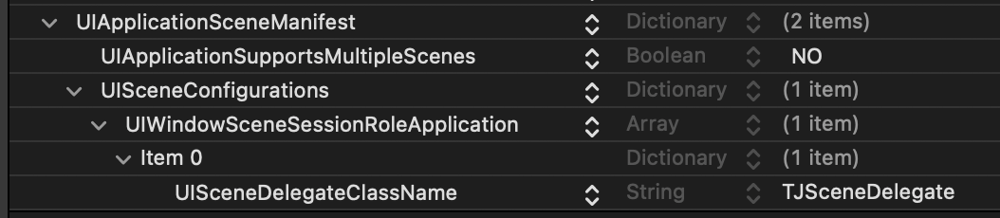

# TJSceneDelegate

It looks like [Apple is going to deprecate the "classic" `UIApplication`-based lifecycle in favor of the newer scene-based lifecycle](https://mastodon.social/@stroughtonsmith/114462715754807267) introduced in iOS 13. I preferred the older lifecycle, it was simpler and a 99.99% of apps don't need the multi-scene setup that the new one introduced. Furthermore, small differences between the two lifecycles lead to common bugs that drive me nuts (like [URLs not being handled on cold start](https://mastodon.social/@timonus/114433444611806352)).

This project is glue between `UISceneDelegate` and `UIApplicationDelegate`. You should be able to configure this and then **forget about the scene-based lifecycle entirely** if I've done my job right. Your app delegate should receive all events as it did previously.

I've held out on the scene-based lifecycle in [all of my apps](https://apps.apple.com/developer/tijo-inc/id332516208), and this project is how I now plan to migrate to it.

## Instructions

- Add the following to your Info.plist



- Conform your app delegate to `TJAppDelegate`
	- Implement `appWindowRootViewController` to return your app's intended root view controller.
	- Implement `window` to the following

```objc
- (UIWindow *)window
{
    return self.appWindowRootViewController.view.window;
}
```

- Remove any creation of `UIWindow`s/`makeKeyAndVisible` calls in your app delegate.